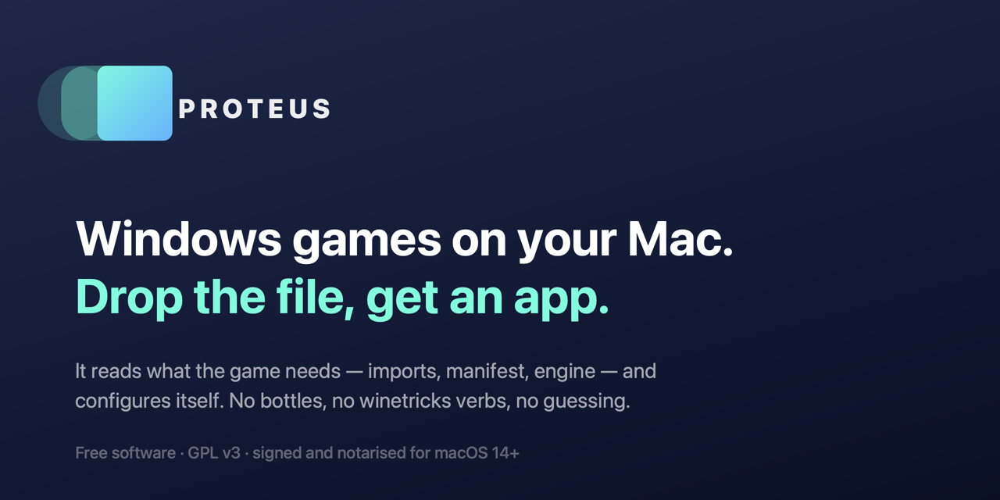
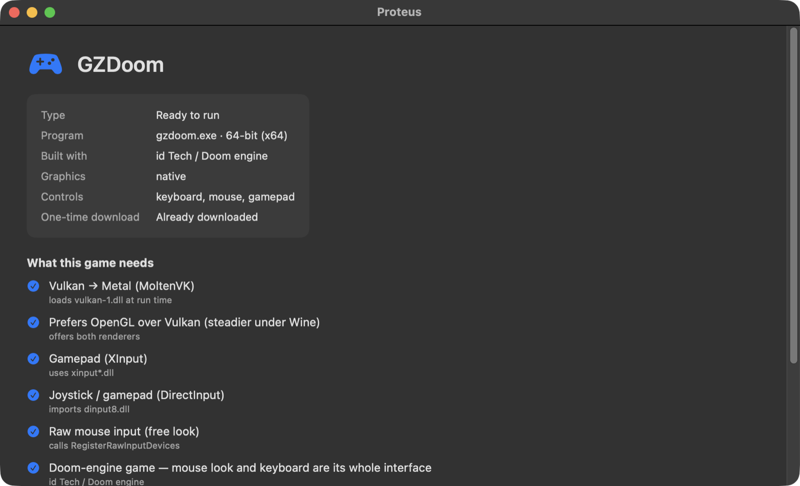
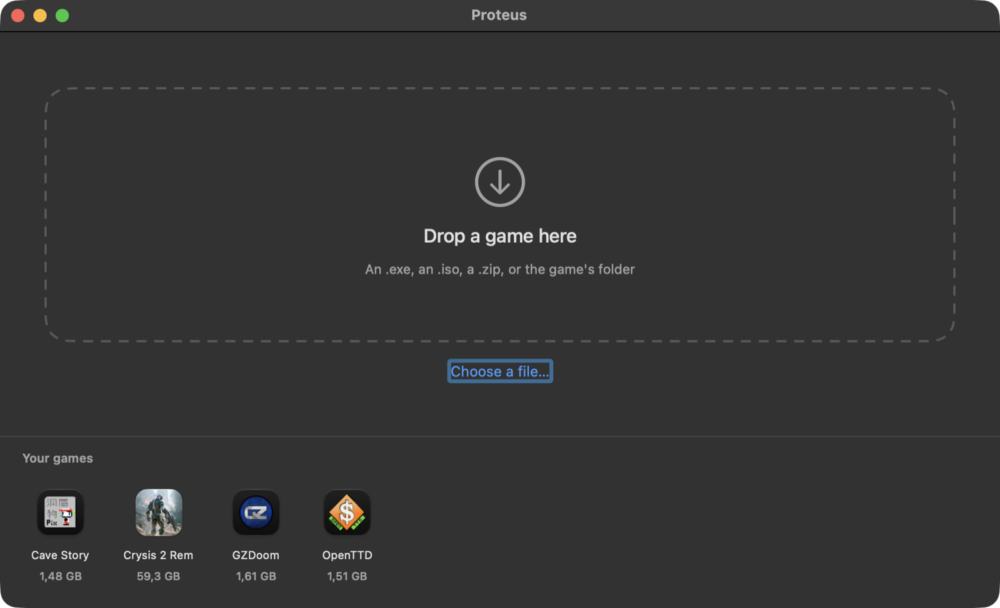

<div align="center">



[](https://github.com/dev-jackson/proteus/actions/workflows/build.yml)
[](LICENSE)
[](#requirements)
[](https://github.com/dev-jackson/proteus/releases/latest)

**[Download for macOS](https://github.com/dev-jackson/proteus/releases/latest)**  ·  [Español](README.es.md)  ·  [How it works](docs/ALGORITHM.md)

</div>

---

Drop an `.exe`, an `.iso`, a `.zip` or a game folder on the window. Proteus reads
the game, works out what it needs, installs it, and leaves an ordinary app in
`/Applications` with the game's own icon.

No bottles. No prefixes. No winetricks verbs. No choosing between WineD3D, DXVK,
DXMT and D3DMetal without being told which one your game can even use.

## It tells you what it found, and why



Every line has evidence behind it. GZDoom imports **no** graphics library at
all — read its import table and you would conclude it needs nothing. It loads
`vulkan-1.dll` by name at run time, which is why that line is there.

That is the whole idea: **a Windows executable already declares most of what it
needs**, in structures that have not changed since the 1990s. Proteus reads them
instead of asking you.

## Then it checks, instead of hoping

After installing, it starts the game, waits for a real window, looks at the
frame it drew, and sends actual keyboard and mouse events to confirm they arrive
— before telling you it is ready.

**It does not promise your game will work. It promises to tell you the truth
about whether it does, and to fix what it can without you learning anything.**



## Install

Download the `.dmg` from [**Releases**](https://github.com/dev-jackson/proteus/releases/latest),
open it, drag **Proteus** to Applications.

Signed with a Developer ID and notarised by Apple, so it opens on a double
click — no right-click-Open, no terminal, no `xattr -d com.apple.quarantine`.

## How it compares

|  | Proteus | Wineskin · Kegworks · Bottles · Porting Kit |
|---|---|---|
| Dependencies | Reads imports, delay imports, the manifest and libraries loaded at run time, then maps each to the exact runtime | You pick verbs from a list |
| Graphics backend | Chosen from what the game actually uses (`d3d12` → D3DMetal, `d3d11` → DXMT, `d3d9` → WineD3D or DXVK) | You pick from a dropdown |
| Which `.exe` is the game | Scored by size, depth, GUI subsystem, icon, graphics imports and `autorun.inf` | You browse and pick |
| Installers | Fingerprints NSIS / Inno Setup / InstallShield / MSI and uses the right silent flags | You click through a wizard inside a fake Windows |
| ISOs | Mounted, `autorun.inf` parsed, disc name used, redistributables ignored | You mount it yourself |
| Icon | Extracted from the executable's resource tree, pixel art upscaled without blurring | Generic Wine glass |
| Verification | **Starts it and confirms a window, a healthy picture and working input** | Nobody does this |
| Disk cost | Engine unpacked once, APFS-cloned per game: ~365 MB each | ~1.4 GB per game |
| Uninstall | Drag to the Trash. Everything lived inside the app | Bottles, prefixes and registry entries left behind |

Even Proton — by far the most successful compatibility layer ever shipped —
does not detect anything. It bundles translation layers and relies on
`protonfixes`, a table of hand-written per-game patches, plus players reporting
results. When a game fails there, the documented procedure is for *you* to set
`PROTON_LOG=1`, reproduce the crash and read the log.

## Tested on

Real installs, played interactively — not just launched — across three weight
classes, because a 40 MB 2D game and a 55 GB DirectX 12 one fail in completely
different ways.

| Game | Arrived as | Size | What it proved |
|---|---|---|---|
| 7-Zip | `.msi` | 2 MB | the MSI path, via `msiexec` |
| Cave Story | `.exe` and `.iso` | 40 MB | disc mounting, `autorun.inf`, keyboard-only input |
| Steam | NSIS installer | 2 MB | a known title needing `-no-cef-sandbox` |
| OpenTTD | NSIS installer | 1.5 GB | silent install omits its graphics — caught and repaired |
| GZDoom + Freedoom | portable `.zip` | 1.6 GB | a renderer that appears only in run-time strings |
| Warzone 2100 | Inno Setup | 371 MB → 2.5 GB | progress on a long install; engine swap and recovery |
| A DirectX 12 CryEngine title | 40 GB disc image | 55 GB installed | the heavy path end to end |

That last one is where most of the hard lessons came from. A 40 GB install
cannot be redone casually, so it forced the interrupted-install recovery
(`proteus finish`), the disk-space pre-check, real progress reporting, and the
discovery that **every DirectX 12 game was getting the wrong Wine engine** —
because the engine has to be chosen before the installer runs, which is before
anything about the game is knowable. Proteus now swaps the engine afterwards
without recopying a byte.

Untested and honest about it: **InstallShield**, and **gamepads** — the code is
there, but no physical controller has been through it. See
[docs/TESTS.md](docs/TESTS.md), which records the failed hypotheses too.

## Requirements

macOS 14 or later, Apple silicon or Intel. Nothing else — no Homebrew, no Xcode
tools, no Rosetta prompt unless a DirectX 12 game genuinely needs one.

The Wine engine (~166 MB) and wrapper template (~80 MB) download once, on first
use. If you already have Sikarugir or Kegworks, Proteus reuses their copies and
downloads nothing.

## Command line

The same engine, without the window:

```bash
proteus inspect ~/Downloads/game.iso     # say what it needs, change nothing
proteus install ~/Downloads/setup.exe    # build the app
proteus install ~/Games/MyGame --name "My Game"
proteus fix "/Applications/My Game.app"  # re-run the installer with its UI
proteus uninstall "My Game"
```

`inspect` never writes anything, so it is safe to run on anything.

## Known limits

- A fullscreen game at 320×240 or 640×480 draws at native size on a black
  backdrop instead of scaling. That is Wine's display handling, not something
  Proteus can fix from outside.
- Installers that fetch optional content only when a human clicks through them
  arrive incomplete. The startup check catches it; `proteus fix` re-runs the
  installer with its interface visible.
- Games with kernel-level anti-cheat do not work, here or anywhere else on macOS.

## Build from source

```bash
swift test              # 16 tests, under a second
./scripts/bundle.sh     # builds build/Proteus.app
open build/Proteus.app
```

## Contributing

Reports of games that **don't** work are the most useful thing anyone can send.
Right click the game in Proteus → **Copy diagnostic report** → open an issue.

See [CONTRIBUTING.md](CONTRIBUTING.md). One rule: never claim a game works
without having watched it work.

## Licence

Free software under the **GNU General Public License, version 3 or later**.
See [LICENSE](LICENSE).

Deliberate: anyone may use, study, change and redistribute this, and any
distributed version must arrive with the same freedoms — so nobody, including
its author, can take a later version closed.

Proteus ships **no third-party code**. Wine, the wrapper template
([Sikarugir](https://github.com/Sikarugir-App/Sikarugir)), DXMT and
[Winetricks](https://github.com/Winetricks/winetricks) are downloaded onto your
machine on first use, the way Homebrew fetches a formula, and used unmodified
under their own licences. See [THIRD-PARTY.md](THIRD-PARTY.md).

---

<div align="center">
<sub>Proteus was the sea god who changed form at will — a lion, a serpent, water,
fire, whatever the moment asked. "Protean" comes from him.<br>
A Windows game becoming a Mac app is the same trick.</sub>
</div>
